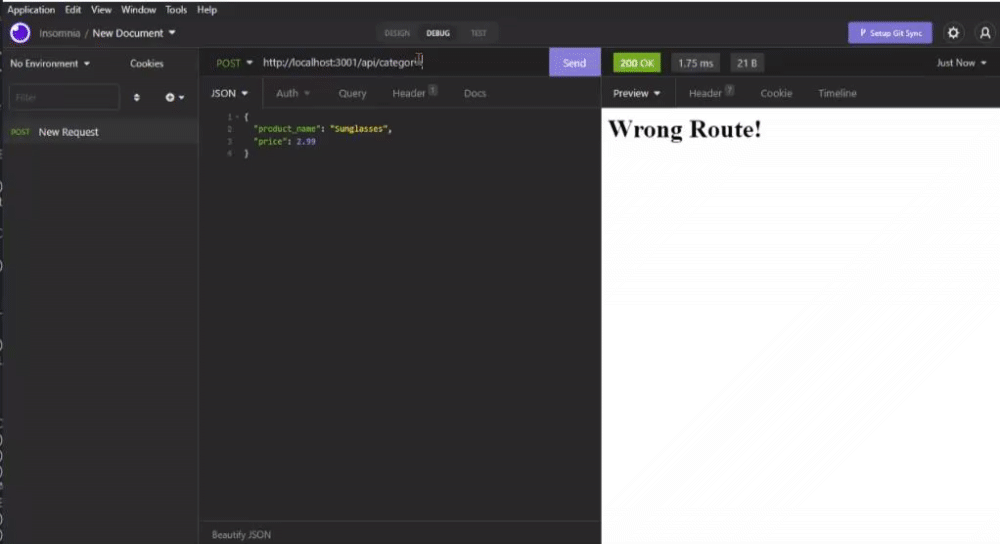

# e-commerce_back_end
 ## Table of Contents 

      
-----------------------------------------

      
 - [Description](#description) 

      
 - [Showcase](#link) 

      
 - [Installation Instructions](#install)

      
 - [Usage Information](#usage) 

     
      
 - [Questions?](#email) 

      
 ## Description 

      
-----------------------------------------

This project consists of using Object-Relational Mapping techniques and building a back end for an example e-commerce site by configuring an existing Express.js API along with using Sequelize and interacting with a MySQL database. 

      
 ## Showcase

      
-----------------------------------------

 Video Tutorial: https://drive.google.com/file/d/1xSe3MPHPbU6kqt3kxQg-LWk2dQytpiHu/view

 

      
 ## Installation Instructions

      
-----------------------------------------
 
      
 After cloning down the repo to your own local, make sure to run `npm install` in order to install the required dependencies and then add the seeds to your `ecommerce_db` by running `npm run seed`. After this you can then run `node server.js` to start the application.

      
 ## Usage Information 

      
-----------------------------------------
 
      
  The dependencies used in this application are `Express`, `Dotenv`, `mysql2` and `Sequelize`. You can use Insomnia to run tests.

      
 

      
 ## Questions?

      
-----------------------------------------
 
      
  My Github: [Akuruu](https://github.com/Akuruu)

      
 Contact Me: anjalismith0529@gmail.com 